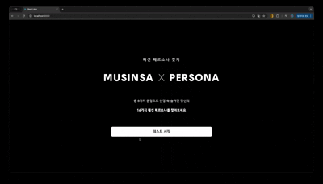
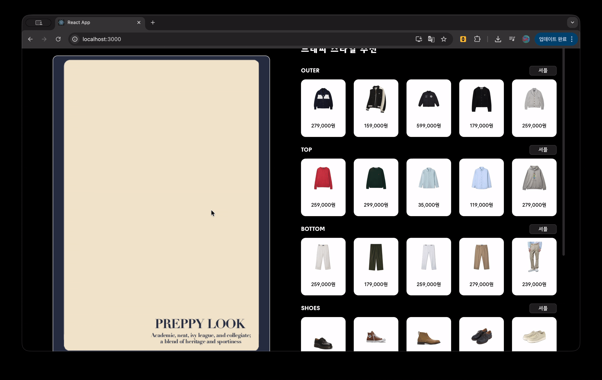
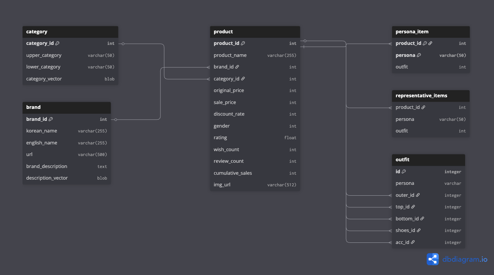

#  🎨 MUSINSA AI 기반 패션 스타일 매칭 및 코디 플랫폼

## 📌 프로젝트 개요

MUSINSA_WEB은 MUSINSA에 등록된 상품을 활용해 제작한 서비스입니다.

MUSINSA_WEB은 사용자의 패션 선호도와 라이프스타일을 분석하여 개인화된 패션 스타일(페르소나) 기반의 상품 추천을 제공하는 AI 웹 애플리케이션입니다.<br>
사용자는 직관적인 인터페이스를 통해 자신의 스타일을 진단받고, AI가 추천한 상품들을 조합하여 가상 코디(아웃핏)를 완성한 후 구매할 수 있습니다.

## ✨ 핵심 기능

📝 **스타일 진단**: 8개 질문을 통해 16가지 페르소나로 분류

🤖 **AI 상품 추천**: 텍스트/이미지/카테고리 임베딩을 결합한 하이브리드 유사도 추천

👕 **가상 코디 (Collage)**: 드래그 앤 드롭으로 상품을 캔버스에 배치하여 나만의 아웃핏 구성

🔍 **금액 필터링**: 가격 범위(Slider) 조정을 통한 맞춤형 상품 탐색

🖼️ **배경 테마**: 사용자의 페르소나 스타일에 맞춰 변경되는 배경 UI

## 🤓 화면 미리보기미리보기

#### 📝 페르소나 검사

#### 🎨 추천 상품 조합


## 🏗️ 프로젝트 구조 및 아키텍처

### 📂 디렉토리 구조
```
MUSINSA_WEB/
├── backend/                          # Flask 기반 백엔드 서버
│   ├── app.py                        # 프로덕션 Flask 애플리케이션 (MySQL 연동)
│   ├── app_local.py                  # 로컬 개발 버전 (SQLite 연동)
│   ├── preprocess.py                 # MySQL DB 기반 마스터 데이터 생성
│   ├── preprocess_local.py           # 로컬 환경용 데이터 전처리
│   └── static/
│       └── processed_imgs/           # 배경제거(rembg) 처리된 이미지 저장소 (* 사용자가 추가해야합니다)
│
├── frontend/                         # React 기반 프론트엔드
│   ├── src/
│   │   ├── App.js                    # 메인 라우팅 및 상태 관리
│   │   ├── CollagePage.js            # 가상 코디 캔버스 (Drag & Drop)
│   │   ├── PurchasePage.js           # 최종 구매 페이지
│   │   ├── data.js                   # 페르소나 데이터 및 질문 세트
│   │   └── ... (CSS 및 컴포넌트)
│   ├── public/
│   │   └── backgrounds/              # 16개 페르소나별 배경 리소스
│   ├── concurrently
│   ├── frontend@0.1.0
│   ├── package-lock.json
│   └── package.json
│
└── requirements.txt                  # Python 의존성 패키지
```
### 🔄 데이터 흐름도 (Data Flow)
```
┌─────────────────────────────────────────────────────────────┐
│  사용자 (User / Web Browser)                                  │
└────────────────────┬────────────────────────────────────────┘
                     │ HTTP/REST API (Axios)
                     ▼
┌─────────────────────────────────────────────────────────────┐
│  Frontend (React)                                           │
│  ├─ Step 1: 스타일 성향 진단 (8문항 → 성향 도출)                   │
│  ├─ Step 2: 페르소나 선택 (성향별 4개 중 선택)                     │
│  ├─ Step 3: CollagePage (AI 추천 및 가상 코디)                  │
│  └─ Step 4: PurchasePage (최종 결제)                          │
└────────────────────┬────────────────────────────────────────┘
                     │ API Requests (/api/products)
                     ▼
┌─────────────────────────────────────────────────────────────┐
│  Backend (Flask)                                            │
│  │                                                          │
│  │ [API Endpoints]                                          │
│  ├─ /api/products: 페르소나/카테고리 기반 추천 로직 수행             │
│  ├─ /api/price-ranges: 카테고리별 가격 범위 반환                  │
│  └─ /api/outfit: 세션별 아웃핏 ID 관리                          │
│                                                             │
│  │ [Data & ML Layer]                                        │
│  ├─ master_data.npz 로드 (In-Memory Caching)                 │
│  ├─ Similarity Ranking (Cosine Similarity)                  │
│  │  └─ Style + Category + Brand + Image Vectors             │
│  └─ Image Processing (rembg 배경 제거)                        │
└────────────────────┬────────────────────────────────────────┘
                     │ Query / Load
                     ▼
        ┌────────────────────────────┐
        │ Database (MySQL / SQLite)  │
        └────────────────────────────┘
```
## 💻 기술 스택 (Tech Stack)  
### Backend (Python 3.8+)  

| 라이브러리 | 용도 | 비고 |
| :--- | :--- | :--- |
| **PyTorch** | REMBG,AI 모델 | |
| **NumPy** | 벡터 연산 | |
| **Pandas** | 마스터 데이터 처리 | |
| **sentence_transformers** | 자연어 임베딩 | |
| **transformers** | 이미지 임베딩(CLIP) | |
| **Flask** | REST API 서버 지원 | |
| **SQLAlchemy** | DB 연결 엔진 |  |
| **REMBG** | 이미지 처리, 배경 제거 | |

### Frontend (Node.js 16+ / React)  

| 라이브러리 | 용도 | 비고 |
| :--- | :--- | :--- |
| **React 19** | UI 라이브러리 | Hooks, State 관리 |
| **Axios** | HTTP 클라이언트 | API 통신 |
| **React Scripts** | 빌드 도구 | Create React App |
| **Concurrently** | 개발 도구 | Front/Back 동시 실행 |

## 🔄 핵심 로직 상세 (Core Logic)
### 1. 스타일 진단 알고리즘
- Step 1 (성향 분류): 8개 문항의 응답을 분석하여 4가지 성향(A/B/C/D) 중 최고점 성향 도출.
  - A: 클래식/고급 (올드머니, 오피스룩)
  - B: 기능성/내구성 (워크웨어, 고프코어)
  - C: 개성/트렌드 (Y2K, 스트릿)
  - D: 편안함/활동성 (블록코어, 시티보이)

- Step 2 (페르소나 결정): 도출된 성향 내에서 심화 질문을 통해 최종 16개 페르소나 중 하나를 확정.

### 2. 상품 추천 시스템 (/api/products)
다양한 벡터의 **가중치 합(Weighted Sum)**을 통해 유사도 점수를 계산하고 랭킹을 매깁니다.<br>
- Step 1 (Filtering): 사용자가 선택한 카테고리 및 가격 범위로 1차 필터링
- Step 2 (Vector Calculation): 페르소나 대표 상품 벡터와 전체 상품 벡터 간 코사인 유사도 계산
- Step 3 (Ranking): 점수 내림차순 정렬 후 상위 100개 중 랜덤 5개 반환

### 3. 데이터 전처리 및 로컬 모드
이미지와 자연어 데이터를 각각 CLIP라이브러리와 S-BERT라이브러리를 통해 임베딩하는 과정을 요구합니다.<br>
- 이미지(image):
  - CLIPProcessor 전처리를, CLIPModel을 통해 임베딩 벡터를 생성합니다.(model id: "openai/clip-vit-base-patch32")<br>
  - L2 정규화를 진행해 내적만으로 코사인 유사도를 구할 수 있게끔 처리합니다.<br>
  - Tensor를 Numpy로 변환해 상품의 ID와 짝지어 .npz 형식으로 저장합니다.<br>
  
- 자언어(sentence):
  - S-BERT 모델을 통해 한국어 데이터를 임베딩합니다.<br>
  - A: 상품명의 경우 200차원의 벡터공간으로 임베딩합니다.(model id: "intfloat/multilingual-e5-base")<br>
  - B: 상품 카테고리의 경우 50차원의 벡터공간으로 임베딩합니다.(model id: "intfloat/multilingual-e5-small")<br>
  - C: 브랜드 정보의 경우 768차원의 벡터공간으로 임베딩합니다.(model id: "sentence-transformers/xlm-r-100langs-bert-base-nli-stsb-mean-tokens")<br>

- preprocess.py를 통해 DB에서 데이터를 조회하고 4가지 임베딩 벡터를 결합해 master_data.npz 생성합니다.<br>

## 🚀 설치 및 실행 방법 (Setup)
#### 1. 환경 변수 설정 (.env)
프로젝트 루트에 .env 파일을 생성한 뒤, 구축되어 있는 DB의 연결정보를 다음과 같이 입력합니다.

DB_HOST=your_local_host  
DB_USER=your_username  
DB_PASSWORD=your_password  
DB_NAME=your_db_name  

#### 2. 의존성 설치
- cd backend <br>
  pip install -r requirements.txt (백엔드)

- cd frontend <br>
  npm install (프론트엔드)

#### 3. 마스터 데이터 생성 (최초 1회)
- python preprocess_local.py  # 로컬(SQLite) 사용 시
- python preprocess.py      # MySQL 사용 시

#### 4. 개발 서버 시작
npm run dev <br>(명령어를 사용하면 백엔드(port:5000)와 프론트엔드(port:3000)를 동시에 실행할 수 있습니다.)

#### (참고) 백엔드 서버 실행
- python app_local.py         # 로컬 모드
- python app.py             # 프로덕션 모드

## 📊 데이터 스키마 

빠른 추천을 위해 모든 상품 정보와 벡터는 압축된 NumPy 포맷으로 캐싱됩니다.  

## master_data.npz 구조
- 키 개수: 10
- 키 목록: ['ids', 'names', 'prices', 'imgs', 'cats', 'lower_cats', 'name_vecs', 'brand_vecs', 'img_vecs', 'cat_vecs']

| 키(Key) | 차원 | 설명 |
| :--- | :--- | :--- |
| **ids** | (N,) | 상품ID  |
| **names** | (N,) | 상품명 |
| **prices** | (N,) | 가격 |
| **imgs** | (N,) | 이미지URL |
| **name_vecs** | (N, 200) | 상품명 텍스트 임베딩 |
| **img_vecs** | (N, 512) | 상품 이미지 임베딩 (ResNet/CLIP) |
| **style_vecs** | (N, Style) | 페르소나별 적합도 벡터 |


ids        | dtype=int64 | shape=(211311,)
names      | dtype=<U94 | shape=(211311,)
prices     | dtype=int64 | shape=(211311,)
imgs       | dtype=<U105 | shape=(211311,)
cats       | dtype=<U4 | shape=(211311,)
lower_cats | dtype=<U12 | shape=(211311,)
name_vecs  | dtype=float32 | shape=(211311, 200)
brand_vecs | dtype=float32 | shape=(211311, 768)
img_vecs   | dtype=float32 | shape=(211311, 512)
cat_vecs   | dtype=float32 | shape=(211311, 50)

## 📈 성능 최적화 (Optimization)
#### Backend:

- In-Memory Caching: 서버 기동 시 master_data.npz를 메모리에 로드하여 I/O 오버헤드 제거.  
- Vector Normalization: 사전 L2 정규화를 통해 코사인 유사도 연산 속도 향상.  
- NumPy Broadcasting: 반복문 없는 벡터화 연산으로 추천 로직 가속화.  

#### Frontend:
- Image Optimization: 배경 제거 이미지를 사용하고 CSS Transform을 활용해 렌더링 부하 최소화.  
- Request Caching: Axios 요청 시 중복 호출 방지 및 캐시 버스팅 적용.  

## 🙋 FAQ

Q: 페르소나는 왜 16개인가요? <br>
A: 우리에게 친숙한 MBTI 검사와 유사하게 초기 페르소나 개수를 16가지로 결정했고 추후 확장할 계획입니다!

Q: 로컬에서 실행 가능한가요? <br>
A: 해당 프로젝트에서 활용한 데이터베이스를 제작한 주체는 무신사이며 상품 이미지 또한 해당 브랜드, 혹은 무신사가 주체가 되어 구성한 저작물입니다.
그렇기에 로컳에서 실행하기 위한 데이터베이스를 재배포 할 수 없음을 안내드립니다.


Last Update: 2026/01/15 
Developed by: 데이터분석가 과정 4조 Team 데스노트

** 해당 프로젝트는 2025 하반기 멀티캠퍼스 데이터분석가 과정 프로젝트 4조 Team 데스노트의 최종 산출물입니다.**
